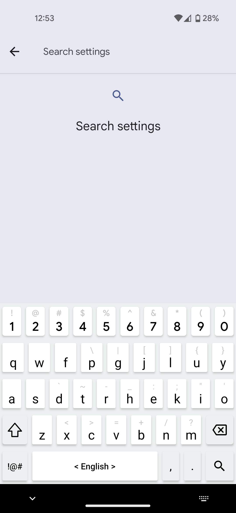
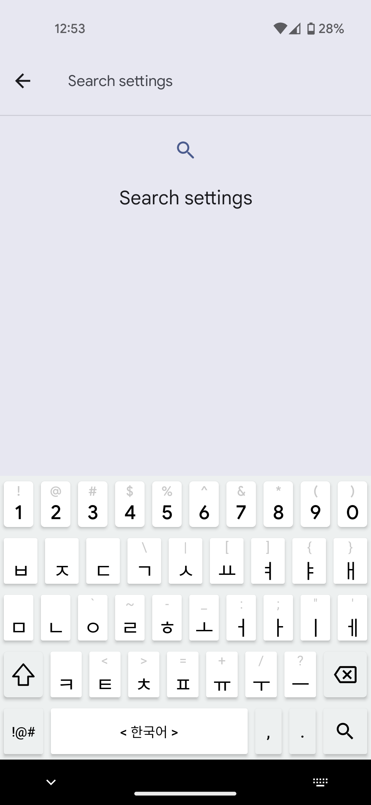
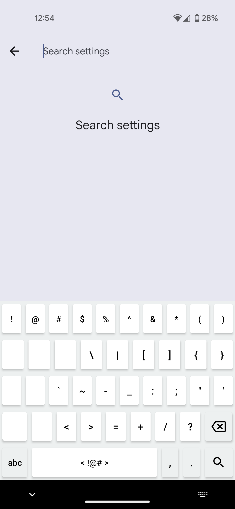
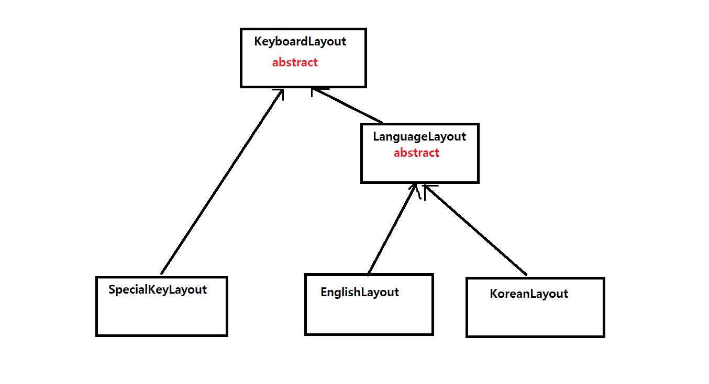

# Custom Layout Keyboard for Android

## Previews:

    
    
    

## Layout Inheritance

Default layout is based on the Colemak layout but slightly different.

Created based on Microsoft SwiftKey.

Implements most of the basic functionality of Microsoft SwiftKey such as swipe on spacebar to change language, swipe on the letters to delete by word and long click to input subtexts.

To change the letter key layout, change the strings in `letterList` in `EnglishLayout.kt` or `KoreanLayout.kt`.

To change the special key layout, change the strings in `subTextLetterList` in `MainKeyboardService.kt`.

Currently Supported Languages:
- English
- Korean

Requires Android 13 (API level 33) or higher
