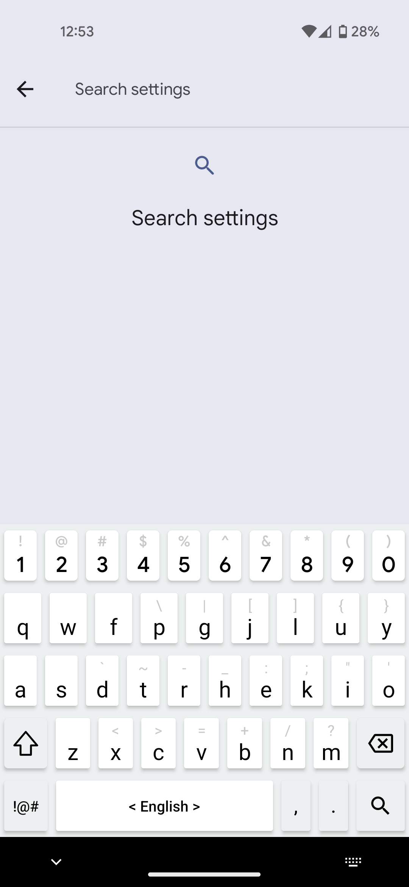
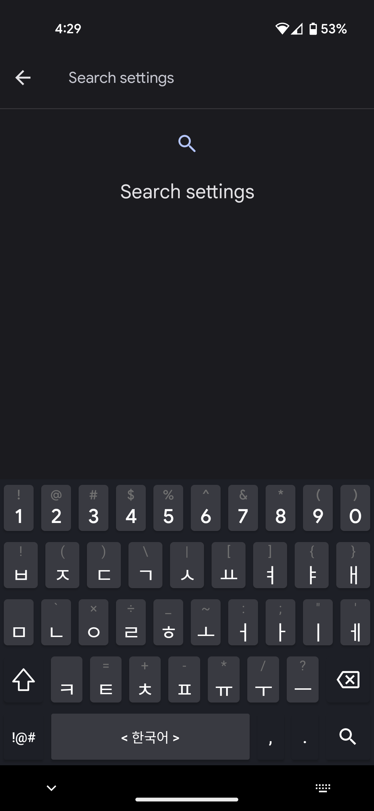
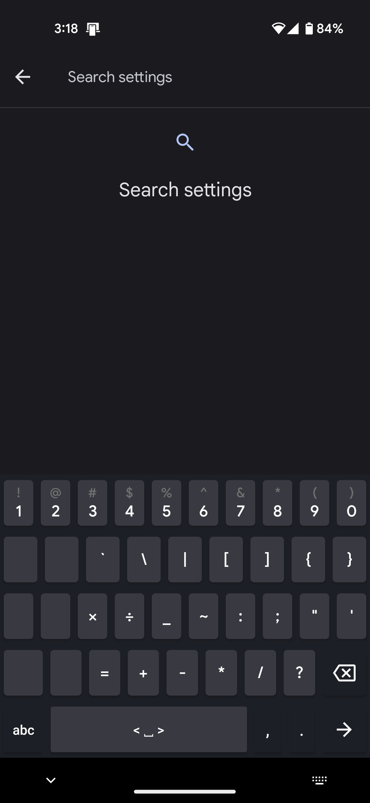

# Custom Layout Keyboard for Android

## Preview:

    
    
    

Anyone can modify and use this app for personal use.

No commercial use.

I built this app because there were no good android keyboards which allowed me to use a custom key layout of my own.

Layout is based on Colemak layout but slightly modified.

Created based on Microsoft SwiftKey.

Implements most of the basic functionality of Microsoft SwiftKey such as swipe on spacebar to change language, swipe on the letters to delete by word and long press to input subtexts.

To change the key layouts change the values of the key list of the kotlin files under the 'layout' folder or MainActivity.kt.

Currently Supported Language:
- English
- Korean

Tested Devices:
- Pixel 4a
